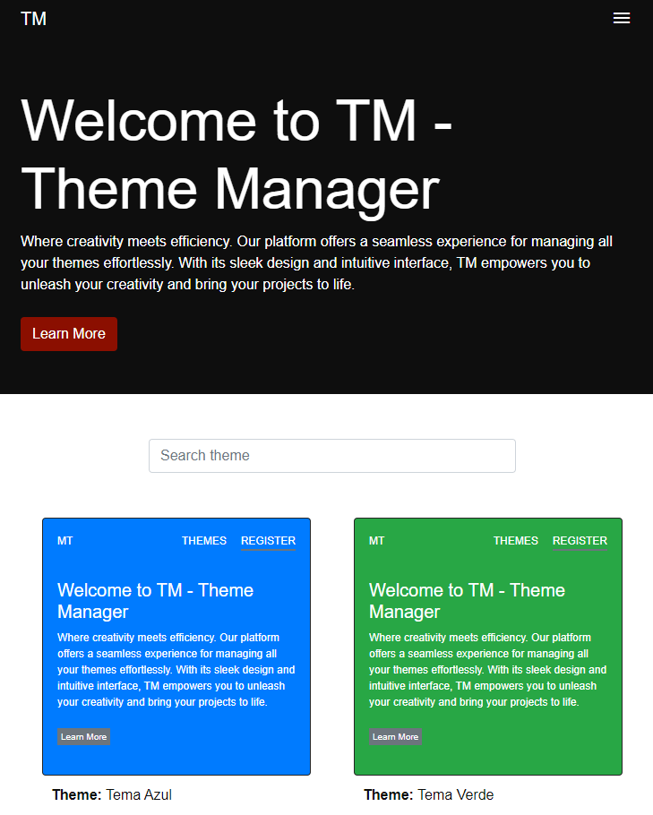
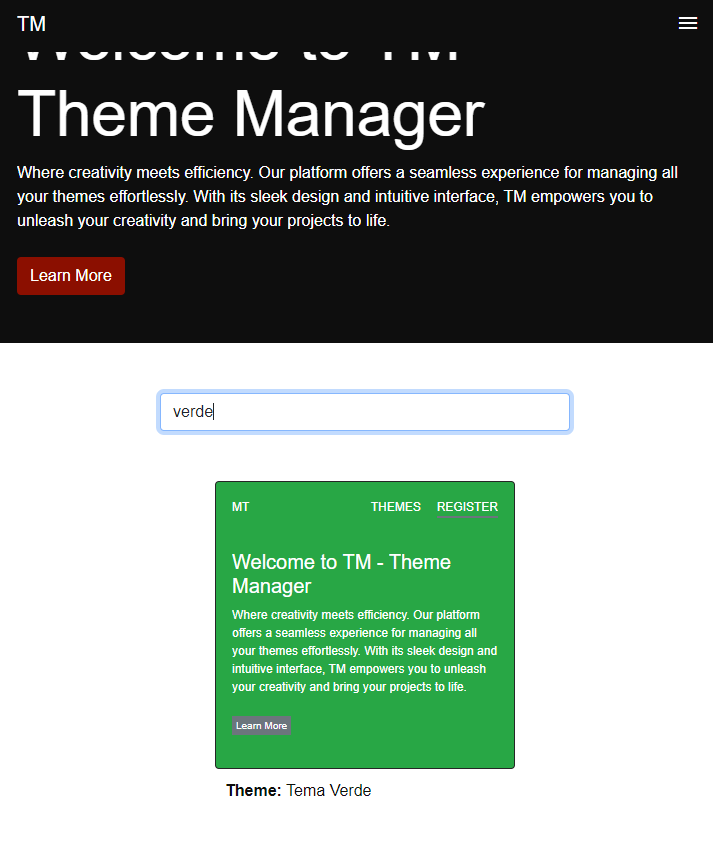
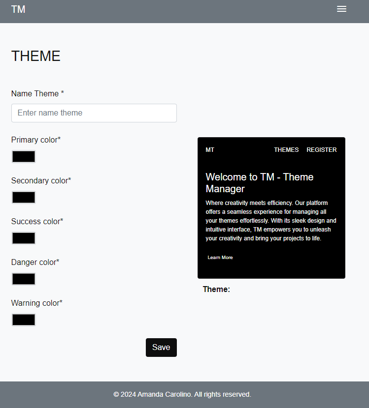
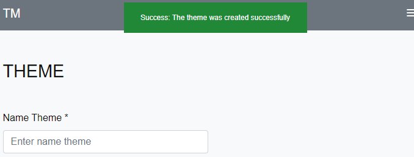
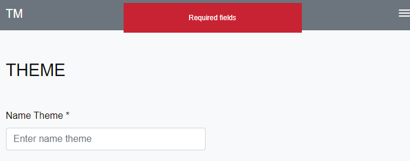
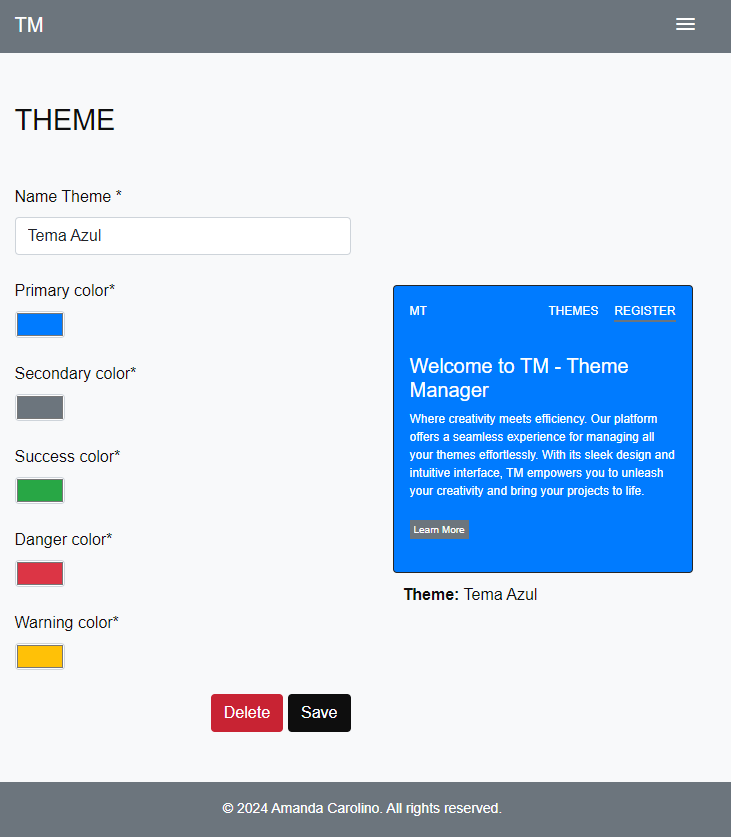
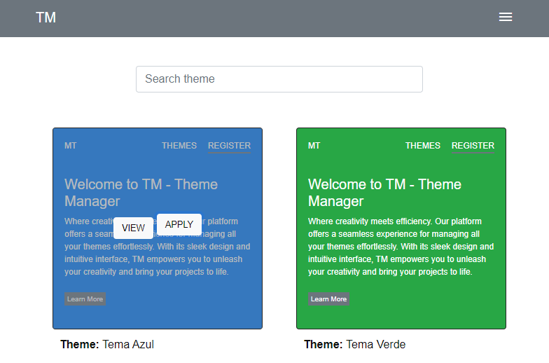

## Theme Management


## About Project:


The objective of this project is to showcase my skills and experience in frontend development by creating a web application for selecting and managing color themes, using a mock JSON to simulate API functionality, with an emphasis on the use of **Vanilla JavaScript**, **HTML**, and **CSS**.

### Technologies

- [CSS](https://developer.mozilla.org/pt-BR/docs/Web/CSS)
- [HTML](https://developer.mozilla.org/pt-BR/docs/Web/HTML)
- [Vanilla JavaScript](https://developer.mozilla.org/pt-BR/docs/Web/JavaScript)
- [BootStrap](https://getbootstrap.com/)

## 🚀 Getting Started

### Prerequisites
- Git 2

### Install project

```bash
git git@github.com:amand4/theme-management.git
cd theme-management
```

### Start project
To start the project, command:

```bash
open index.html
```

### Feature: Theme management:

1. **List themes:**

   - On the home screen, you can view registered themes.

   

---

2. **Search temas:**

   - Search field allows you to search for themes by name.

   
---

3. **Create themes:**

   - To create a theme, access the registration screen through the menu.

   

   - Case success 
      

   - Or error: Do not fill in the name field
         
     
---

4. **Edit themes:**

   - To access the editing screen:
   - click on the desired theme.
   - Click the "view" button.
   - You will be redirected to the editing screen.

   
     
---

5. **Apply themes:**

   - Access the home screen:
   - click on the desired theme.
   - Click the "apply" button.

   

   
---


6. **Delete themes:**

   - To access the editing screen:
   - click on the desired theme.
   - Click the "view" button.
   - If ok, go to the next stepYou will be redirected to the editing screen.
   - Click the "delete" button.

---
